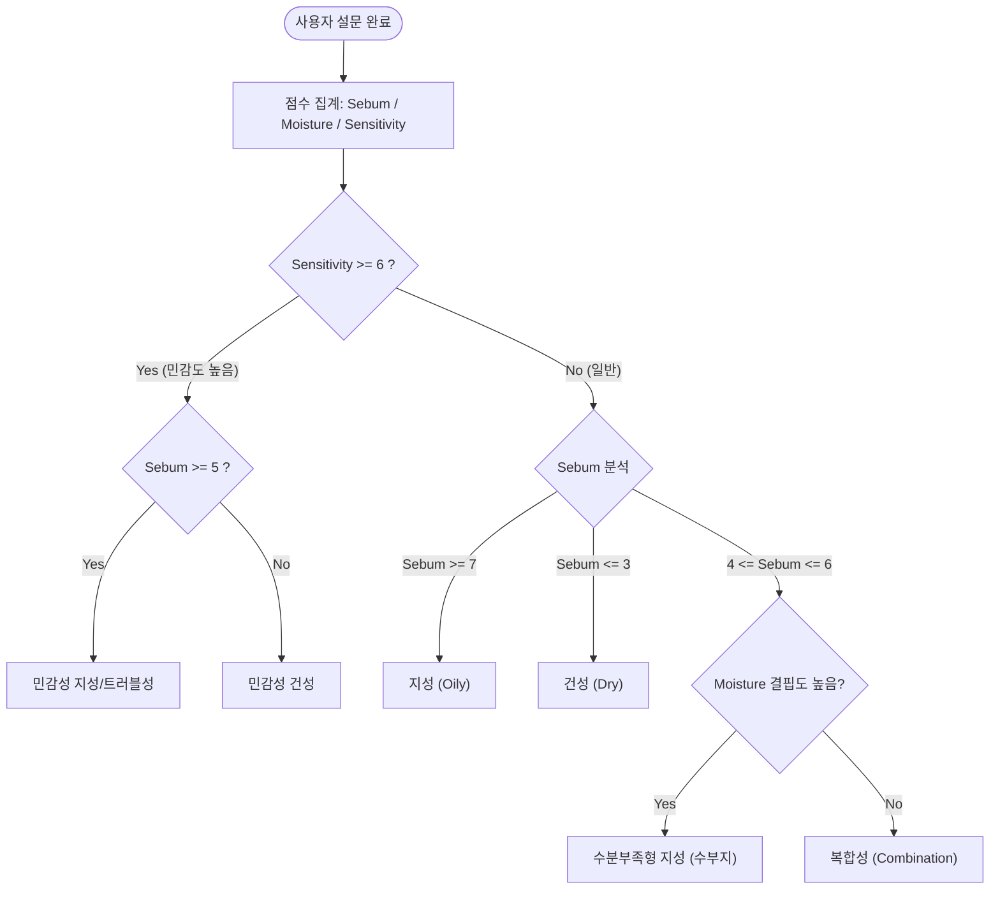

# [PRD] 맞춤형 피부타입 진단 및 성분 추천 서비스 (SkinType Finder)

---

## 1. 프로젝트 개요 (Product Overview)

### 1.1 제품명 (가칭)
- **SkinType Finder (스킨핏 / 내 피부 설명서)**

### 1.2 배경 및 필요성
- 피부과, 에스테틱, 피부 진단 센터는 비용이 비싸고 예약 및 직접 방문의 번거로움이 큼.
- 시중에는 수많은 화장품이 존재하지만, 정작 사용자는 자신의 정확한 피부 타입을 알지 못해 잘못된 제품을 구매하고 트러블이나 건조함을 악화시키는 경우가 빈번함.
- 복잡한 기기 없이 **몇 가지 핵심 질문(당김, 번들거림, 트러블 빈도 등)에 답변하는 '버튼 클릭(딸깍)'만으로 1~2분 안에 자신의 피부 타입을 파악**하고, **꼭 필요한 화장품 성분 및 주의 성분을 즉시 확인**할 수 있는 정적 웹 기반 셀프 진단 도구를 구축함.

### 1.3 핵심 목표
1. **접근성 극대화**: 로그인이나 설치 없이 링크 접속 즉시 시작 가능한 웹 환경.
2. **신뢰성 있는 진단 로직**: 바우만 피부 유형(Baumann Skin Type)의 핵심 분류 기준(유수분 밸런스, 민감도)을 대중적으로 재구성한 룰 기반 진단.
3. **실질적인 행동 유도**: 단순 결과("지성입니다")에 그치지 않고, 화장품 성분표를 볼 때 참고할 수 있는 **[BEST 추천 성분]**과 **[주의/비추천 성분]**, **[스킨케어 팁]** 제공.
4. **100% 정적 데이터/서버리스**: 별도의 데이터베이스나 백엔드 서버 없이 정적 데이터(JSON)와 프론트엔드 로직만으로 완전 구동.

---

## 2. 타겟 사용자 (Target Audience & Persona)

| 페르소나 | 특징 및 니즈 |
| :--- | :--- |
| **화장품 유목민 (2030 남녀)** | 남들이 좋다는 화장품을 샀다가 피부가 뒤집히거나 겉돌아, 내 피부의 근본적 타입(수부지인지, 건성인지 등)을 명확히 알고 싶음. |
| **가성비/효율 추구형 사용자** | 피부과 방문 검사 비용이 아깝고, 간편하게 스마트폰으로 몇 번 눌러서 알짜배기 가이드만 얻고 싶음. |
| **스킨케어 입문자** | 토너, 세럼, 크림을 살 때 전성분 표의 어떤 성분을 보고 골라야 하는지 기준이 없음. |

---

## 3. 피부 타입 분류 체계 및 진단 로직

### 3.1 피부 타입 분류 (총 6가지 세부 타입)
단순 4대 타입(건성/지성/복합성/민감성)을 넘어, 한국인에게 가장 흔한 **수분부족형 지성(수부지)** 및 **민감성**을 결합한 6개 타입으로 정밀화:

1. **극건성/건성 (Dry Skin)**: 유·수분 모두 부족하여 항상 당기고 각질이 잘 일어나는 타입
2. **지성 (Oily Skin)**: 피지 분비가 왕성하여 얼굴 전체가 쉽게 번들거리고 모공/블랙헤드가 발달한 타입
3. **수분부족형 지성 (Dehydrated Oily Skin - 수부지)**: 속은 당기는데 겉은 기름진 한국인 대표 복합 피부
4. **복합성 (Combination Skin)**: T존은 번들거리고 U존(볼/턱)은 건조한 타입
5. **민감성 건성 (Sensitive Dry Skin)**: 건조함과 동시에 외부 자극, 화장품 변경 시 쉽게 붉어지고 따가운 타입
6. **민감성 지성/트러블성 (Sensitive Oily/Acne-prone Skin)**: 과도한 피지와 함께 염증성 트러블 및 붉은 기가 잦은 타입

---

### 3.2 진단 축 (Diagnosis Axes) 및 평가 문항
3개의 직교 평가 축을 기반으로 점수를 합산하여 타입을 결정합니다.

1. **유분 축 (Sebum / Oiliness: 0 ~ 10점)**: 피지 분비량, 오후 번들거림 정도, 모공 크기
2. **수분/당김 축 (Moisture / Hydration: 0 ~ 10점)**: 세안 직후 당김, 속당김 느낌, 각질 일어남
3. **민감성 축 (Sensitivity: 0 ~ 10점)**: 자극 반응(붉어짐, 따가움), 트러블 주기, 계절/환경 민감도

#### 설문 문항 예시 (총 6~7문항, 객관식 3~4지선다)
- **Q1 (세안 직후 느낌)**: "세안 후 아무것도 바르지 않고 10분이 지났을 때 피부 상태는?"
  - ① 얼굴 전체가 심하게 당기고 찢어질 것 같다 (수분 결핍 High, 건성)
  - ② 볼 부위는 당기지만 T존(이마, 코)은 편안하다 (복합/수부지)
  - ③ 별로 당기지 않고 평온하다 (중성)
  - ④ 벌써부터 유분이 살짝 올라오며 미끌거린다 (지성 High)
- **Q2 (오후 번들거림)**: "스킨케어 후 4~5시간이 지난 오후, 거울을 보았을 때?"
  - ① 메이크업이나 피부가 들뜨고 각질이 부각된다 (건성)
  - ② 이마와 코(T존)만 번들거리고 볼은 건조하다 (복합성)
  - ③ 이마, 코는 물론 볼까지 얼굴 전체에 기름종이가 젖을 만큼 유분이 돈다 (지성)
  - ④ 겉은 번들거리는데 속은 여전히 메마르고 건조하다 (수부지)
- **Q3 (자극 및 민감도)**: "새로운 화장품을 쓰거나 마스크 착용, 미세먼지가 심할 때 피부 반응은?"
  - ① 거의 문제없이 무난하게 적응한다 (저민감도)
  - ② 컨디션에 따라 가끔 간지럽거나 뾰루지가 1~2개 올라온다 (중민감도)
  - ③ 붉게 달아오르거나 따갑고, 접촉성 트러블이 쉽게 일어난다 (고민감도)
- **Q4 (트러블 및 여드름 빈도)**: "뾰루지나 좁쌀/화농성 여드름이 얼마나 자주 생기나요?"
- **Q5 (모공 및 블랙헤드)**: "거울을 보았을 때 모공의 크기와 블랙헤드는 어느 정도인가요?"
- **Q6 (환절기 각질 및 당김)**: "환절기나 겨울철에 피부가 하얗게 트거나 가려운 적이 있나요?"

---

### 3.3 판정 알고리즘 (Scoring Logic)


---

## 4. 정적 추천 데이터 모델 (Data Schema)

서버 없이 JSON 파일 하나로 모든 타입별 성분, 가이드, 제품군을 관리합니다.

```json
{
  "typeId": "dehydrated_oily",
  "name": "수분 부족형 지성 (수부지)",
  "badge": "💧 속건조 탈출형",
  "summary": "겉은 번들거리지만 속은 바짝 마른 사막 같은 피부 상태입니다.",
  "characteristics": [
    "유분은 많으나 세안 직후 속당김이 심함",
    "유수분 밸런스가 무너져 피지 과다 분비",
    "메이크업 시 유분 때문에 무너지면서도 각질이 뜸"
  ],
  "scores": { "oil": 7, "waterDeficit": 8, "sensitivity": 5 },
  "goodIngredients": [
    { "name": "히알루론산", "role": "피부 속까지 수분을 채워 속당김 완화" },
    { "name": "판테놀 (비타민 B5)", "role": "수분 장벽 강화 및 유수분 균형 조절" },
    { "name": "나이아신아마이드", "role": "과도한 피지 분비 억제 및 모공 케어" }
  ],
  "badIngredients": [
    { "name": "고함량 쉐어버터/미네랄오일", "reason": "모공을 막아 트러블 유발 가능" },
    { "name": "변성알코올(고함량)", "reason": "일시적 청량감 뒤 수분을 빼앗아 속당김 악화" }
  ],
  "skincareRoutineTip": "가벼운 워터/젤 타입의 수분 토너를 2~3번 레이어링하고, 끈적이지 않는 젤 크림으로 얇은 수분막을 씌워주세요."
}
```

---

## 5. UI/UX 화면 구성 및 사용자 여정 (User Journey)

### 5.1 화면 플로우 (User Flow)
1. **[랜딩 페이지 (Home)]**
   - 헤드 카피: *"내 피부, 진짜 알고 바르고 계신가요? 1분 피부 타입 진단"*
   - 서브 카피: *"비싼 피부과 방문 없이 버튼 몇 번으로 내 피부 타입과 꼭 맞는 성분을 찾아보세요."*
   - 주요 포인트: '무료 / 회원가입 없음 / 소요시간 1분' 배지
   - [테스트 시작하기] 메인 CTA 버튼
2. **[진단 페이지 (Questionnaire)]**
   - 상단 프로그레스 바 (1 / 6 단계)
   - 질문 카드 (크고 터치하기 쉬운 선택지 버튼)
   - 선택 시 부드러운 전환 애니메이션 (Fade-in/Slide)
   - [이전 질문] 버튼 제공
3. **[분석 중 로딩 화면 (Analyzing)]**
   - 1.5초간 신뢰감을 높이는 마이크로 애니메이션 ("피부 유수분 밸런스 분석 중...", "맞춤 추천 성분 매칭 중...")
4. **[결과 페이지 (Result)]**
   - 최종 피부 타입 타이틀 & 일러스트/아이콘 카드
   - 피부 레이더 차트 (유분도 / 수분부족도 / 민감도 시각화)
   - **MUST HAVE 성분 (BEST 3)** & **AVOID 성분 (주의 2)**
   - 맞춤형 아침/저녁 스킨케어 루틴 가이드
   - 부가 기능:
     - [결과 링크 복사 / 카카오톡 공유]
     - [테스트 다시하기]

---

## 6. 기술 아키텍처 및 추천 스택 (Technical Architecture)

### 6.1 프론트엔드 중심의 완전 정적(Static) 구조
- **서버 비용 0원**: API 서버나 DB 없이 GitHub Pages, Vercel, Netlify 등에 단일 정적 배포 가능.
- **초고속 응답 속도**: 모든 데이터가 번들에 포함되거나 정적 JSON으로 페치되므로 딜레이 없음.
- **모바일 퍼스트(Mobile-First) 반응형 디자인**: 사용자의 80% 이상이 모바일 웹 환경에서 유입됨을 감안하여 모바일 뷰 최적화.

### 6.2 권장 기술 스택 비교

| 구분 | 추천 스택 (Vite + React + Tailwind) | 대안 1 (Next.js 14 App Router) | 대안 2 (Vanilla HTML/JS + Tailwind) |
| :--- | :--- | :--- | :--- |
| **적합성** | **가장 강력 추천 (표준 SPA)** | SEO 및 추후 확장 필요 시 | 빌드 환경 없이 즉시 파일 열기 필요 시 |
| **장점** | 개발 속도 초고속, 풍부한 애니메이션 라이브러리(Framer Motion), 가벼운 정적 번들링 | 향후 OG 태그 동적 생성 및 공유 기능 최적화 용이 | node_modules나 빌드 없이 브라우저로 바로 실행 가능 |
| **추천 라이브러리** | Lucide-React (아이콘), Canvas-Confetti (결과 폭죽), Chart.js/Recharts (레이더 차트) | Tailwind CSS, Lucide | Lucide Web, Chart.js CDN |

---

## 7. 기능 명세서 (Functional Requirements)

| 모듈 | 기능 | 상세 설명 | 우선순위 |
| :--- | :--- | :--- | :---: |
| **랜딩** | 진단 진입 | 서비스 소개 문구 확인 및 시작 버튼 클릭 시 1번 문항으로 진입 | P0 |
| **문답** | 질문 인터랙션 | 단일 선택형 답변 버튼 클릭 시 선택 상태 시각화 후 다음 문항 자동 전환(또는 다음 버튼) | P0 |
| **문답** | 진행률 표시 | 전체 문항 대비 현재 진행 상태를 상단 프로그레스 바(%)로 제공 | P0 |
| **문답** | 되돌아가기 | 이전 질문으로 돌아가 답변 수정 가능 | P1 |
| **결과** | 점수 기반 타입 도출 | 응답 배열을 바탕으로 유분/수분/민감도 점수 합산 후 6개 타입 중 1개 확정 | P0 |
| **결과** | 성분 매칭 렌더링 | 해당 타입에 정의된 좋은 성분 3개, 피해야 할 성분 2개와 그 이유 툴팁/설명 표시 | P0 |
| **결과** | 결과 공유 / 저장 | 현재 결과를 클립보드에 복사하거나 카카오톡 공유 링크 생성 (Query Param 또는 Web Share API) | P1 |
| **결과** | 다시 하기 | 설문 응답을 리셋하고 랜딩 화면으로 복귀 | P0 |

---

## 8. 로드맵 및 구현 단계 (Implementation Phases)

1. **Phase 1: 데이터 셋업 및 채점 로직 모듈화**
   - `questions.json` (질문 및 선택지별 가중치)
   - `skinTypes.json` (6개 피부 타입 상세 데이터 및 추천/주의 성분)
   - `scoreCalculator.ts` (점수 계산 및 타입 판별 순수 함수 작성 및 단위 테스트)
2. **Phase 2: UI 프로토타입 및 컴포넌트 개발**
   - Tailwind 기반 디자인 시스템 (파스텔톤 스킨케어 테마: 청록/민트/소프트블루/로즈)
   - Landing, QuestionCard, ProgressBar, ResultCard 컴포넌트
3. **Phase 3: 상태 연동 및 인터랙션 강화**
   - 문항 전환 애니메이션, 결과 로딩 시뮬레이션 (1.2초)
   - 유수분 밸런스 레이더 차트 또는 비주얼 게이지 바 연동
4. **Phase 4: 공유 기능 및 최종 검증**
   - Web Share API 및 클립보드 복사
   - 모바일/데스크톱 반응형 뷰 테스트

